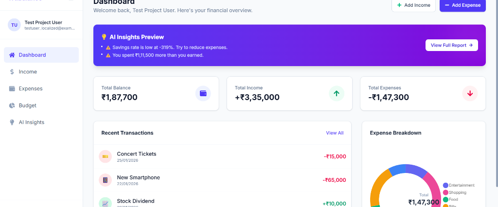
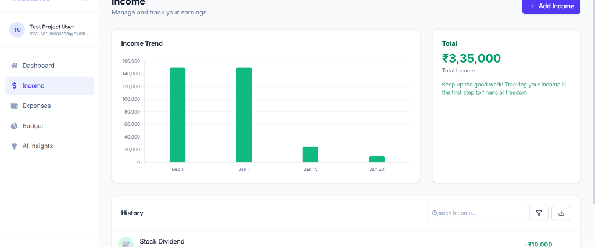
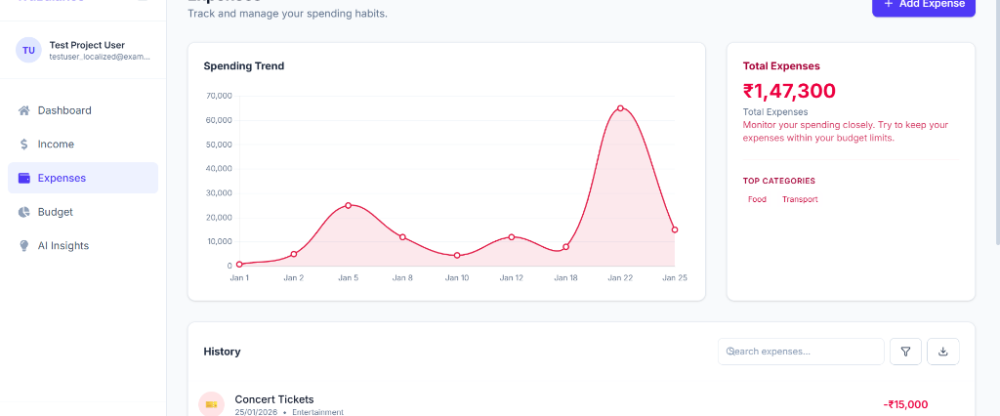
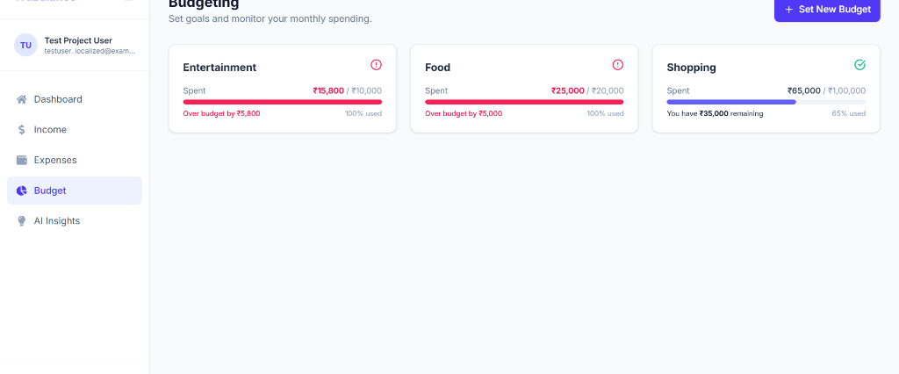
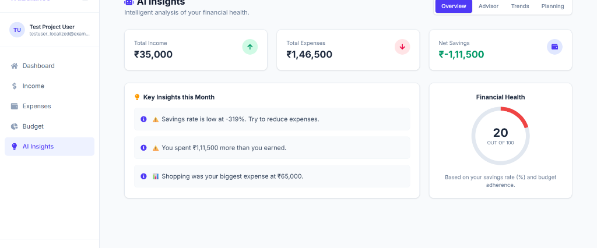

# TruBalance - Advanced Expense Tracker

TruBalance is a full-stack MERN application designed to help users take control of their financial health. Be it tracking daily expenses, setting budgets, or getting AI-driven financial advice, TruBalance provides a comprehensive dashboard for all your needs.



## 🚀 Core Features

-   **Dashboard Overview**: Visualize your total balance, income, expenses, and recent transactions at a glance.
-   **Income & Expense Tracking**: Log your earnings and spending with categorized entries.
-   **Advanced Filtering & Search**: Find specific transactions by category, date range, or amount. Export data to Excel for offline analysis.
-   **Budget Planning**: Set monthly budgets for different categories and track your progress in real-time.
-   **AI Financial Advisor**: Get personalized insights and recommendations based on your spending habits using advanced AI analysis.
-   **Visual Analytics**: Interactive charts and graphs to understand your financial trends.

## 🛠️ Technology Stack

-   **Frontend**: React, Vite, TailwindCSS
-   **Backend**: Node.js, Express.js
-   **Database**: MongoDB
-   **AI Integration**: Custom AI controller for financial insights.

---

## 📸 Application Walkthrough

### 1. Dashboard
The command center of your financial life. View your current balance, monthly summary, and a quick snapshot of where your money is going.


### 2. Income Management
Track all your revenue streams. Use the **Search**, **Filter**, and **Export** buttons to manage your records efficiently.


### 3. Expense Tracking
Monitor your spending habits. Visual trends help you identify high-spending days and categories.


### 4. Smart Budgeting
Set limits for entertainment, food, shopping, and more. Visual progress bars keep you accountable and prevent overspending.


### 5. AI Insights
Unlock the power of AI to analyze your finances. Get a "Credit Score" style health rating and actionable advice to improve your savings rate.


---

## 💻 Getting Started

1.  **Clone the repository**:
    ```bash
    git clone https://github.com/yourusername/trubalance.git
    ```

2.  **Install Dependencies**:
    ```bash
    # Install backend dependencies
    cd server
    npm install

    # Install frontend dependencies
    cd ../client
    npm install
    ```

3.  **Run the Application**:
    ```bash
    # Start Backend (Port 5000)
    cd server
    npm run dev

    # Start Frontend (Port 5173/5174)
    cd client
    npm run dev
    ```
