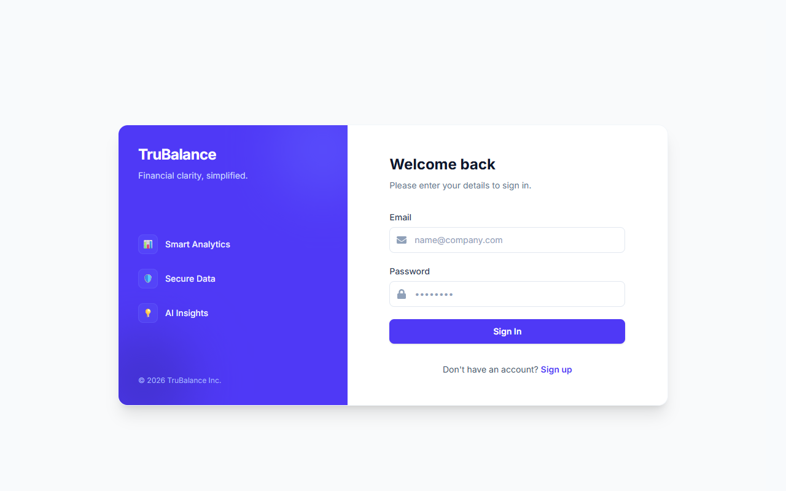
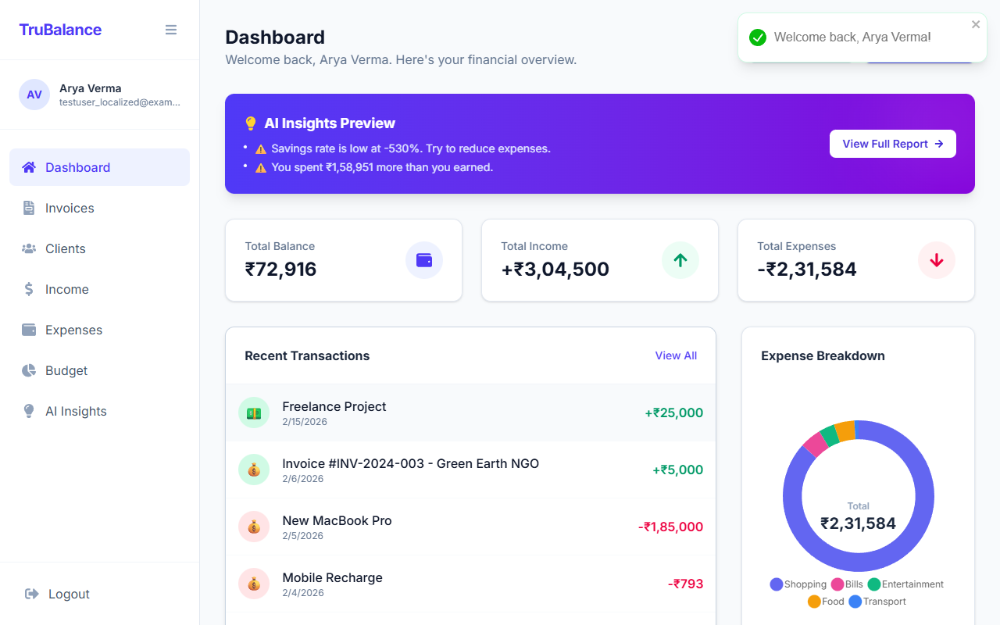
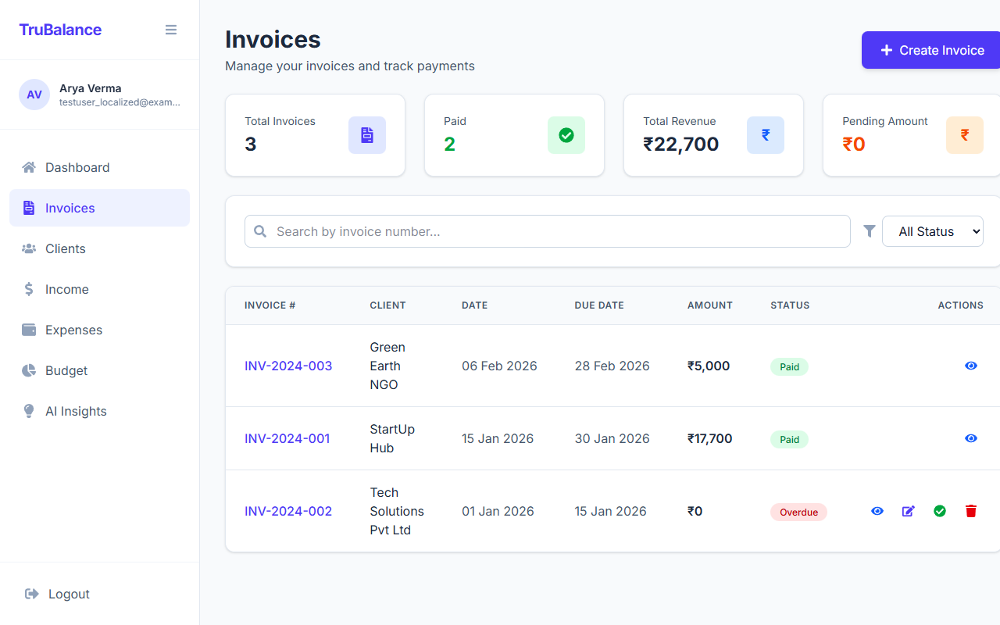
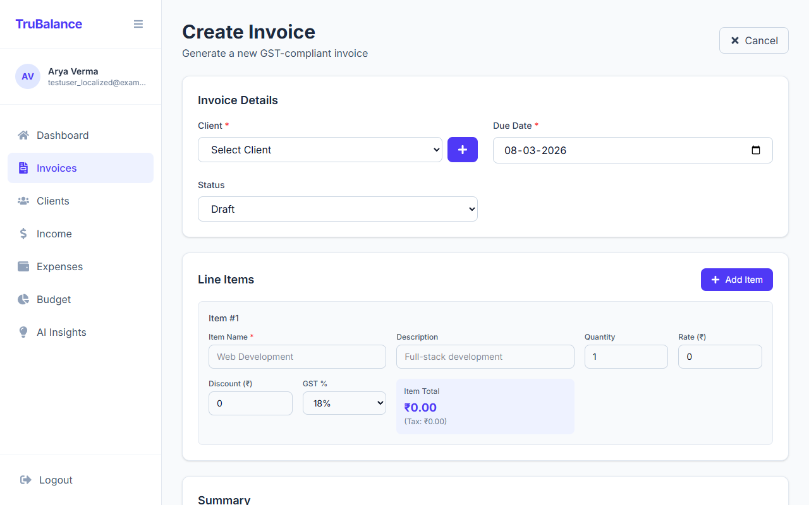
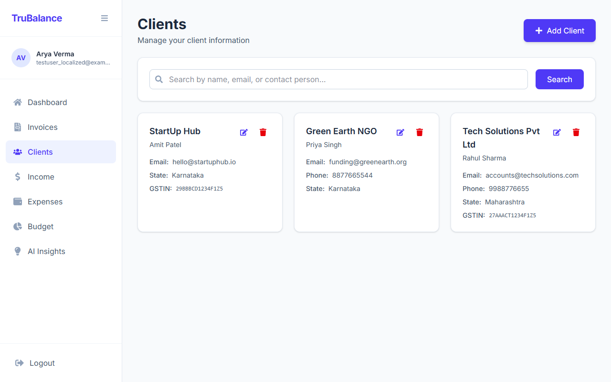
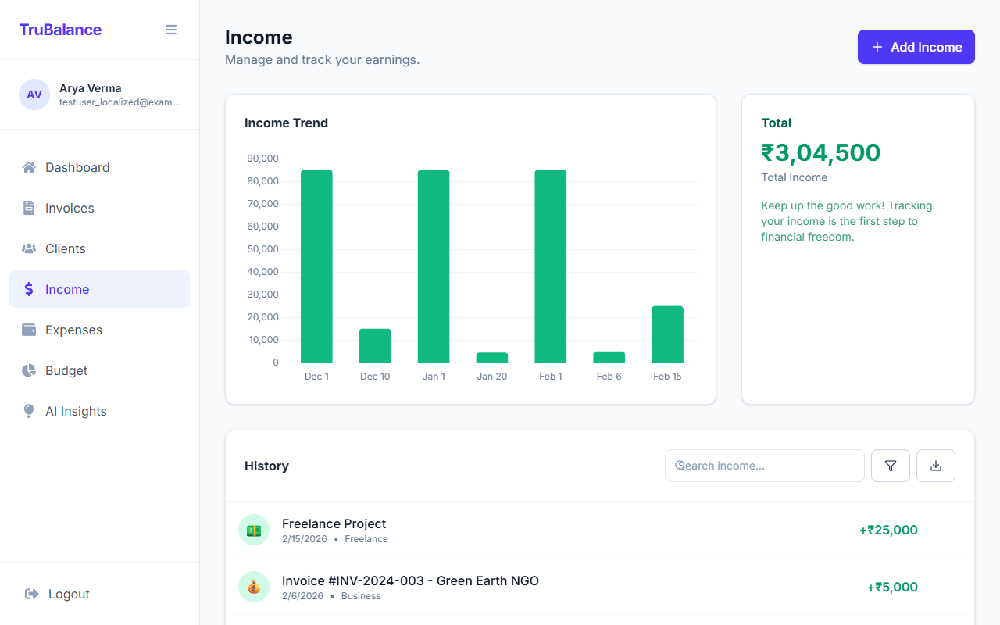
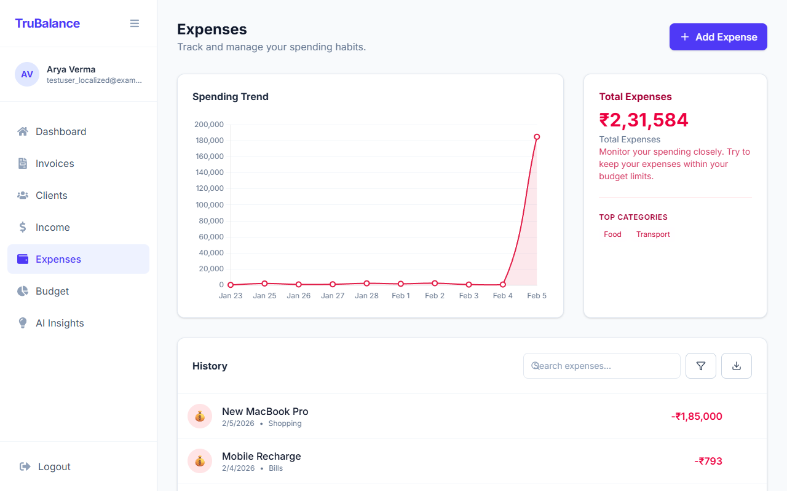
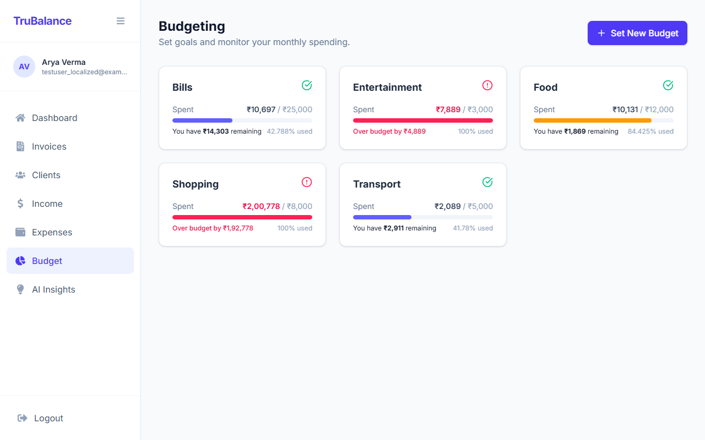

# TruBalance - Smart Expense Tracker & Invoicing App


*(Replace with actual banner or screenshot of dashboard)*

## 🚀 Overview

**TruBalance** is a comprehensive financial management tool designed for freelancers and small businesses. It combines powerful expense tracking, professional invoicing, and AI-driven insights into a single, intuitive interface. 

Built with the MERN stack (MongoDB, Express, React, Node.js), TruBalance ensures your financial data is secure, accessible, and actionable.

### Key Capabilities
- **Smart Invoicing:** Create, send, and track GST-compliant invoices.
- **Expense Tracking:** Log and categorize expenses effortlessly.
- **AI Insights:** Get personalized budget recommendations and spending analysis.
- **Client Management:** Maintain a detailed database of your clients.
- **Financial Health:** Visualize your income, expenses, and net balance in real-time.

---

## 🛠️ Technology Stack

- **Frontend:** React, Vite, Tailwind CSS, Recharts
- **Backend:** Node.js, Express.js
- **Database:** MongoDB
- **Authentication:** JWT (JSON Web Tokens)
- **AI Integration:** Google Gemini (for insights and auto-categorization)

---

## 📸 Features & Walkthrough

### 1. Landing Page
Clean and modern landing page introducing the application's value proposition.


### 2. Secure Authentication
Secure user registration and login system to protect your financial data.


### 3. Dashboard
Your financial command center. View real-time stats on total income, expenses, and balance. Quick access buttons allow you to immediately log an expense or create an invoice.


### 4. Invoice Management
Create professional invoices with automatic GST calculation.
*   **Create:** Easy-to-use form for adding clients, line items, and tax details.
*   **Track:** Monitor status (Draft, Sent, Paid, Overdue).
*   **Automated Income:** Mark an invoice as "Paid" and it automatically records as Income.



### 5. Client Management
Keep all your client details in one place for quick invoicing. Store GSTIN, contact details, and addresses.


### 6. Income Tracking
Visualize your earnings with clear charts and transaction history.


### 7. Expense Tracking
Log and categorize expenses to see exactly where your money goes.


### 8. Smart Budgeting
Set limits for categories like Food or Shopping and get alerts when you're close to overspending.


### 9. AI Insights
Get personalized financial advice and monthly reports powered by AI.


---

## ⚙️ Installation & Setup

Follow these steps to run TruBalance locally.

### Prerequisites
*   Node.js (v14+)
*   MongoDB (Local or Atlas URI)

### 1. Clone the Repository
```bash
git clone https://github.com/yourusername/trubalance.git
cd trubalance
```

### 2. Backend Setup
Navigate to the server directory and install dependencies:
```bash
cd server
npm install
```

Create a `.env` file in the `server` folder:
```env
PORT=5001
MONGO_URI=your_mongodb_connection_string
JWT_SECRET=your_jwt_secret
GEMINI_API_KEY=your_gemini_api_key
```

Start the backend server:
```bash
npm run dev
```

### 3. Frontend Setup
Open a new terminal, navigate to the client directory, and install dependencies:
```bash
cd client
npm install
```

Create a `.env` file in the `client` folder (optional, defaults are set):
```env
VITE_API_URL=http://localhost:5001
```

Start the frontend development server:
```bash
npm run dev
```

Visit `http://localhost:5173` in your browser to see the app!

---

## 🤝 Contributing

Contributions are welcome! Please fork the repository and submit a pull request for any enhancements or bug fixes.

---

## 📄 License

This project is licensed under the MIT License.
